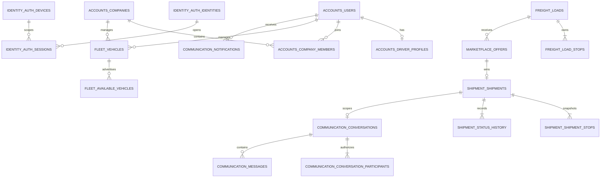

# Database ERD v1 — Architecture v1.0 Lock

PostgreSQL/PostGIS source of truth; schema/table ownership [database ownership](database-ownership.md)da. Barcha domain PKlar UUID. `created_at`, `updated_at` va business timestamps `timestamptz`/UTC; pul `amount bigint` + `currency char(3)` va floating point emas.

## Core relationship diagram

Diagram ownershipni schema prefix bilan ko‘rsatadi; mapping/reference va delivery jadvallarining hammasi diagramga tiqilmagan, quyidagi katalog authoritative.

## Classification codes

- `O` — public/non-sensitive operational;
- `I` — identity/contact;
- `B` — company/business;
- `V` — vehicle;
- `L` — precise location (sensitive);
- `C` — communication;
- `D` — verification/sensitive document;
- `A` — authentication/security (high sensitivity);
- `F` — future financial (not in v1 tables).

Field-level nuance va viewer/retention [data inventory](../privacy/data-inventory.md)da.

## Identity tables

| Table | PK, references va important uniques | Timestamps / lifecycle | Class | Key indexes |
| --- | --- | --- | --- | --- |
| `identity.auth_identities` | `id`; `user_id -> accounts.users` unique; normalized `phone_e164` unique; status | created/updated, `phone_verified_at`, disabled/anonymized lifecycle; hard delete faqat account policy bilan | `A`, `I` | unique normalized phone; `(user_id,status)` |
| `identity.auth_devices` | `id`; `user_id -> accounts.users`; installation fingerprint/hash; unique `(user_id,installation_id_hash)` | created/updated, `last_seen_at`, `revoked_at`; stale device purge retention OPEN LEGAL DECISION | `A` | `(user_id,revoked_at)`, `last_seen_at` |
| `identity.auth_sessions` | `id`; identity/user/device IDs; unique `refresh_token_hash`; status/rotation family | `issued_at`, `expires_at`, `last_used_at`, `revoked_at`; expired rows purged after security retention decision | `A` | `(user_id,status)`, `(device_id,status)`, `expires_at`, token hash unique |

OTP challenge/value PostgreSQL’da saqlanmaydi: Redis TTL, attempt counter va rate-limit key. Security auditda OTPning o‘zi yozilmaydi.

## Accounts tables

| Table | PK, references va important uniques | Timestamps / lifecycle | Class | Key indexes |
| --- | --- | --- | --- | --- |
| `accounts.users` | `id`; display name, status; auth credential yo‘q | created/updated, `anonymized_at`; status/anonymize, blind soft-delete flag yo‘q | `I` | `(status,created_at)` |
| `accounts.user_consents` | `id`; user ID, consent type, policy version, source; unique acceptance record | `accepted_at`, nullable `withdrawn_at`; append/preserve evidence, effect/retention OPEN LEGAL DECISION | `I`, `A` | `(user_id,consent_type,accepted_at desc)`, policy version |
| `accounts.driver_profiles` | `id`; `user_id -> users` unique; profile/verification status | created/updated; deactivate/anonymize per account policy | `I`, `D` | unique user, verification status |
| `accounts.driver_documents` | `id`; `driver_profile_id`; document type, private `storage_key`, media/size/hash | created/updated, `expires_at`, `deleted_at` only controlled object deletion; retention OPEN LEGAL DECISION | `D` | `(driver_profile_id,document_type)`, expiry |
| `accounts.driver_verifications` | `id`; profile, verifier user, status/reason/evidence version | `decided_at`; append-only, no soft delete | `D`, `A` | `(driver_profile_id,decided_at desc)`, verifier |
| `accounts.companies` | `id`; legal/display name, optional business identifiers; normalized business ID unique where present | created/updated, `archived_at`; archive not hard delete while referenced | `B` | normalized identifier unique, `(status,name)` |
| `accounts.company_members` | `id`; company/user IDs; active membership unique `(company_id,user_id)` | created/updated, `removed_at`; removal preserves audit/history | `B`, `I` | unique company+user, `(user_id,removed_at)` |
| `accounts.roles` | `id`; stable `code` unique; scope `GLOBAL`/`COMPANY`; label | created/updated, deactivate rather than delete if assigned | `O`, `A` | code unique, scope |
| `accounts.permissions` | `id`; stable capability `code` unique; sensitivity category | created/updated; seed/config lifecycle | `O`, `A` | code unique |
| `accounts.role_permissions` | composite `(role_id,permission_id)` | created; hard delete assignment through audited policy | `A` | reverse permission index |
| `accounts.user_roles` | composite `(user_id,role_id)`; only GLOBAL role | created, `revoked_at`; active unique | `A` | `(user_id,revoked_at)`, role |
| `accounts.company_member_roles` | composite `(company_member_id,role_id)`; only COMPANY role | created, `revoked_at`; active unique | `A`, `B` | member active, role |
| `accounts.security_audit_log` | `id`; actor/subject/resource IDs nullable, action, outcome, correlation ID, minimal metadata | `occurred_at`; append-only/immutable; retention OPEN LEGAL DECISION | `A` plus minimized category-specific IDs | `(actor_user_id,occurred_at)`, `(resource_type,resource_id,occurred_at)`, correlation ID |

## Fleet tables

| Table | PK, references va important uniques | Timestamps / lifecycle | Class | Key indexes |
| --- | --- | --- | --- | --- |
| `fleet.vehicle_types` | `id`; stable `code` unique, localized label | created/updated, active flag | `O` | code unique, active |
| `fleet.body_types` | `id`; stable `code` unique | created/updated, active flag | `O` | code unique, active |
| `fleet.vehicle_capabilities` | `id`; stable `code` unique | created/updated, active flag | `O` | code unique, active |
| `fleet.vehicles` | `id`; exactly one `owner_user_id`/`manager_company_id`; type/body IDs; normalized plate unique; capacity/volume; status/version | created/updated, `archived_at`; no hard delete while offer/shipment referenced | `V`, `B`/`I` | plate unique, owner, company, `(type_id,body_type_id,status)` |
| `fleet.vehicle_capability_assignments` | composite `(vehicle_id,capability_id)` | created; assignment delete allowed only by vehicle use case | `V` | capability reverse index |
| `fleet.vehicle_documents` | `id`; vehicle ID; type, private storage key, media/size/hash | created/updated, expires/deleted timestamps; retention OPEN LEGAL DECISION | `D`, `V` | `(vehicle_id,document_type)`, expiry |
| `fleet.vehicle_verifications` | `id`; vehicle, verifier user, decision/status/reason | `decided_at`; append-only | `D`, `A`, `V` | `(vehicle_id,decided_at desc)`, verifier |
| `fleet.available_vehicles` | `id`; vehicle ID; status; `current_location geography(Point,4326)`; optional `desired_destination geography(Point,4326)`; availability window/version | created/updated, closes/expires via status; no location history | `L`, `V` | GiST current/destination; `(status,available_from,available_until)`; vehicle+status |

## Freight tables

| Table | PK, references va important uniques | Timestamps / lifecycle | Class | Key indexes |
| --- | --- | --- | --- | --- |
| `freight.loads` | `id`; exactly one owner user/company; status/version; cargo fields (type/description/weight/volume/quantity); pricing mode, amount/currency; nullable unique `accepted_offer_id` | created/updated, published/matched/cancelled/expired timestamps; lifecycle preserves record | `O`, `B`, amount operational | `(status,created_at,id)` cursor, owner/company, accepted offer unique where non-null |
| `freight.load_stops` | `id`; load ID; unique `(load_id,sequence)`; type/address; `location geography(Point,4326)`; contact name/phone; schedule window | created/updated; owned delete only while load draft; preserved after publish | `L`, `I`, `O` | GiST location; `(load_id,sequence)` unique; `(stop_type,schedule_from)` |
| `freight.load_requirements` | `id`; `load_id` unique; required fleet type/body IDs, minimum capacity/volume | created/updated; owned with draft load | `O` | type/body/capacity filters |
| `freight.load_required_capabilities` | composite `(load_id,capability_id)` | created; draft-owned | `O` | capability reverse index |
| `freight.load_images` | `id`; load ID; private/scoped storage key, media/size/hash/order; unique `(load_id,display_order)` | created/updated, controlled `deleted_at`; binary retention follows load/account decision | operational image; may contain sensitive cargo/location context | load+order, hash |

Cargo initial fields `loads` ichida owned value object sifatida saqlanadi; mustaqil lifecycle bo‘lmagani uchun `cargo` table yaratilmadi.

## Marketplace table

| Table | PK, references va important uniques | Timestamps / lifecycle | Class | Key indexes |
| --- | --- | --- | --- | --- |
| `marketplace.offers` | `id`; load, creator/carrier user/company, driver profile, vehicle IDs; amount/currency; optional message; status/version; **partial unique `(load_id) WHERE status='ACCEPTED'`** | created/updated, accepted/rejected/withdrawn/expired timestamps; terminal offers preserved | `B`, `I`, message is `C` | load+status+created, creator+status, vehicle+status, accepted partial unique |

## Shipment tables

| Table | PK, references va important uniques | Timestamps / lifecycle | Class | Key indexes |
| --- | --- | --- | --- | --- |
| `shipment.shipments` | `id`; `offer_id` unique, `load_id` unique; shipper user/company, carrier/driver/vehicle assignment IDs; accepted amount/currency; current status/version | created/updated, assigned/pickup/delivered/completed timestamps; no soft delete | `B`, `I`, `V` | offer/load unique, participant+status, driver+status, status+updated |
| `shipment.shipment_stops` | `id`; shipment ID; unique sequence; type, address, location snapshot, contact snapshot, schedule | created; immutable execution snapshot, deletion follows shipment retention | `L`, `I` | `(shipment_id,sequence)` unique; no nearby GiST query requirement in MVP |
| `shipment.shipment_status_history` | `id`; shipment, previous/new status, actor user nullable/system, reason code/context-minimized, shipment version unique | `changed_at`; append-only, no update/delete | `B`, `A` | `(shipment_id,changed_at)`, actor+changed, unique shipment+version |

## Communication tables

| Table | PK, references va important uniques | Timestamps / lifecycle | Class | Key indexes |
| --- | --- | --- | --- | --- |
| `communication.conversations` | `id`; `shipment_id` unique for MVP; type/status | created/updated, closed timestamp; retention OPEN LEGAL DECISION | `C`, `B` | shipment unique, status+updated |
| `communication.conversation_participants` | composite `(conversation_id,user_id)`; role; last-read message/time | joined/left/read timestamps; membership history retained with conversation | `C`, `I` | user+left, conversation active |
| `communication.messages` | `id`; conversation/sender IDs; body or private attachment metadata; immutable sequence unique per conversation | `created_at`; no edit/delete in v1; retention/deletion OPEN LEGAL DECISION | `C` | `(conversation_id,created_at,id)` cursor; sender+created; sequence unique |
| `communication.notifications` | `id`; recipient user, type, source type/ID, minimized template data, read state | created, read, expires timestamps; purge after product/legal retention | `C`, `I` | `(recipient_user_id,read_at,created_at)`, source ID, expiry |
| `communication.communication_preferences` | `id`; user, channel, notification type; unique tuple | created/updated; hard delete means default policy | `C`, `I` | unique user+channel+type |
| `communication.push_endpoints` | `id`; user, optional `identity.auth_devices` ID; protected provider token hash/ciphertext; unique provider+token hash | created/updated, last seen/revoked; stale purge policy | `A`, `I` | user+revoked, token hash unique |
| `communication.notification_deliveries` | `id`; notification, endpoint/channel, attempt/idempotency key unique, status/error code | created/updated, attempted/delivered timestamps; operational retention | `C`, `A` | notification+status, next-attempt, idempotency unique |

## PostGIS v1

[ADR-0014](decisions/0014-geospatial-representation.md) bo‘yicha real-world points `geography(Point,4326)` va SRID 4326. Longitude/latitude alohida authoritative column sifatida takrorlanmaydi; API projection `ST_X/ST_Y` orqali chiqaradi.

- `freight.load_stops.location` va `fleet.available_vehicles.current_location/desired_destination`da GiST;
- nearby load: `ST_DWithin(pickup.location, :driverPoint, :radiusMeters)` + `loads.status='PUBLISHED'` + stop type/schedule + requirement filter, keyset cursor bilan;
- nearby vehicle: `ST_DWithin(current_location, :pickupPoint, :radiusMeters)` + active window/status/type/capability;
- radius har doim server-side maximum va request rate limit bilan;
- exact location response permission/purpose bilan minimallashtiriladi; search uchun distance/coarse area yetarli bo‘lsa point qaytarilmaydi;
- route/direction ranking uchun keyinchalik PostGIS line/route provider result qo‘shilishi mumkin, ammo v1 schema’da taxminiy route line saqlanmaydi.

## Constraint checklist

- positive amount/weight/volume va valid availability/schedule windows uchun `CHECK`;
- XOR owner (`owner_user_id` vs `company_id`) uchun `CHECK`;
- enum/status DB check yoki reference policy migration bilan versioned;
- optimistic `version bigint not null` `Load`, `Offer`, `Shipment`, `Vehicle`, `AvailableVehicle`da;
- cross-module FK no cascade; cross-module mutation faqat public API;
- binary object DB’da emas, private storage key + verified metadata DB’da.
