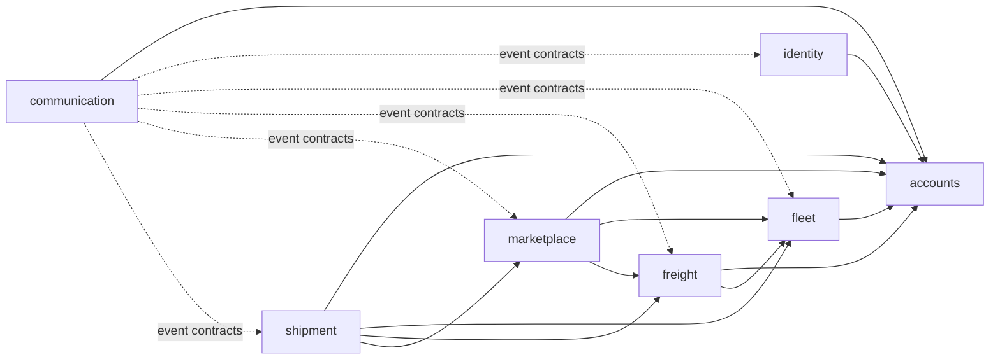

# Modul chegaralari — Architecture v1.0 Lock

Ushbu hujjat canonical kontekstdagi [modul qoidalarini](../../architecture/architecture-context-v1.md#10-backend-module-boundaries) implementation darajasida aniqlashtiradi. Aggregate tafsilotlari [domen modelida](domain-model.md), cross-module eventlar [event katalogida](event-catalog.md), jadvallar esa [database ERD](database-erd.md) hujjatida berilgan.

## Umumiy qoida

- bog‘liqliklar acyclic bo‘ladi;
- modul boshqa modulning internal repositorysi yoki persistence entitysini import qilmaydi;
- modul boshqa modul jadvalini to‘g‘ridan-to‘g‘ri o‘zgartirmaydi;
- cross-module aloqa faqat public application API yoki e’lon qilingan event contract orqali;
- controller inputni tarjima qiladi va use case chaqiradi, biznes qarori qabul qilmaydi;
- adapter va infrastructure domen qarorini belgilamaydi;
- `shared/common` faqat UUID typed ID, vaqt, `Money`, `GeoPoint`, event envelope va authenticated-principal kabi barqaror primitive/contractlar bilan cheklanadi;
- shared business service, generic repository, umumiy persistence entity yoki “utils” qatlami taqiqlanadi.

## `identity`

**Mas’uliyat.** Telefon/OTP authentication, authentication identity, access-token lifecycle, refresh session va security device boshqaruvi.

**Aggregate/entitylar.** `AuthenticationIdentity`, `AuthSession`, `AuthDevice`; OTP challenge Redis’dagi qisqa muddatli security state, PostgreSQL aggregate emas.

**Public application API.** `VerifyOtpAndRegister`, `Authenticate`, `RefreshSession`, `RevokeSession`, `RevokeAllUserSessions`, `ListUserSessions`, `ResolveAuthenticatedPrincipal`.

**Publish.** `UserRegistered`.

**Consume.** MVP cross-module eventi yo‘q.

**Allowed dependency.** `accounts` public `ProvisionUser` API; SMS provider faqat outbound port orqali.

**Forbidden.** Profil, role/permission, company, vehicle, load yoki shipment qarorlari; business authorization; raw OTP/tokenni log yoki persistent plaintext ko‘rinishda saqlash.

**Data ownership.** `identity.auth_identities`, `identity.auth_sessions`, `identity.auth_devices`; Redis OTP/rate-limit key namespace.

## `accounts`

**Mas’uliyat.** Stable `User`, `DriverProfile`, `Company`, membership, server-side role/permission, resource/company authorization va security audit yozuvi.

**Aggregate/entitylar.** `User`; `DriverProfile`; `Company` + `CompanyMember`; `Role`, `Permission`; driver document/verification metadata.

**Public application API.** `ProvisionUser`, `GetUserSummary`, `CreateOrUpdateDriverProfile`, `CreateCompany`, `AddCompanyMember`, `RemoveCompanyMember`, `AssignUserRole`, `AssignCompanyMemberRole`, `Authorize`, `GetDriverEligibility`, `AppendSecurityAudit`.

**Publish.** `CompanyMemberAdded`, `CompanyMemberRemoved`, `DriverVerificationChanged`.

**Consume.** Eventga asoslangan user yaratish ishlatilmaydi: `identity` userni sync public API orqali yaratadi, so‘ng `UserRegistered`ni cross-cutting reactionlar uchun chiqaradi.

**Allowed dependency.** Stable shared primitive va provider portlar; boshqa business modulga bog‘lanmaydi.

**Forbidden.** OTP/session lifecycle, vehicle/load/offer/shipment holatini boshqarish; admin roliga avtomatik sensitive-data access berish.

**Data ownership.** `accounts.users`, `driver_profiles`, `driver_documents`, `driver_verifications`, `companies`, `company_members`, `roles`, `permissions`, role mapping jadvallari va `security_audit_log`.

## `fleet`

**Mas’uliyat.** Vehicle aktivlari, backend-driven type/body/capability reference data, vehicle hujjati/verifikatsiyasi va vaqt/joyga bog‘langan `AvailableVehicle` listingi.

**Aggregate/entitylar.** `Vehicle`, `VehicleDocument`, `VehicleVerification`; `AvailableVehicle`; `VehicleType`, `BodyType`, `VehicleCapability` reference entitylari.

**Public application API.** `CreateVehicle`, `UpdateVehicle`, `DeactivateVehicle`, `GetVehicleSummary`, `VerifyVehicle`, `PublishAvailableVehicle`, `CloseAvailableVehicle`, `SearchNearbyVehicles`, `ValidateVehicleEligibility`.

**Publish.** `VehicleVerified`, `AvailableVehiclePublished`, `AvailableVehicleClosed`.

**Consume.** Accounts eligibility o‘zgarishi availabilityni avtomatik o‘chirishni talab qilsa `DriverVerificationChanged` — reliable/idempotent policy handler.

**Allowed dependency.** `accounts` public authorization/driver eligibility API.

**Forbidden.** Offer qabul qilish, load matching winnerini tanlash, shipment assignment/status yoki accounts jadvalini o‘zgartirish.

**Data ownership.** `fleet.vehicle_types`, `body_types`, `vehicle_capabilities`, `vehicles`, capability mapping, `vehicle_documents`, `vehicle_verifications`, `available_vehicles`.

## `freight`

**Mas’uliyat.** `Load` listingi, cargo, tartiblangan stoplar, requirement, pricing intent, image metadata va load lifecycle.

**Aggregate/entitylar.** `Load` root; owned `Cargo`, `LoadStop`, `LoadRequirement`, `LoadPricing`, `CargoImageMetadata`.

**Public application API.** `CreateLoad`, `UpdateDraftLoad`, `PublishLoad`, `CancelLoad`, `ExpireLoad`, `GetLoadSummary`, `SearchLoads`, `ValidateOfferEligibility`, `MatchLoad`.

`MatchLoad(loadId, acceptedOfferId, expectedVersion)` faqat `PUBLISHED -> MATCHED`ni concurrency-safe bajaradi; offerning o‘zini o‘zgartirmaydi.

**Publish.** `LoadPublished`, `LoadCancelled`, `LoadExpired`, `LoadMatched`.

**Consume.** MVP cross-module eventi yo‘q. `Load` shipment completionini takrorlamaydi; `MATCHED` load uchun terminal.

**Allowed dependency.** `accounts` public authorization API; fleet type/capability IDlari contract sifatida reference qilinadi, live eligibility kerak bo‘lsa `fleet` public API.

**Forbidden.** Offer repositorysi, shipment lifecycle, notification yuborish, client-side location filterga tayanish.

**Data ownership.** `freight.loads`, `load_stops`, `load_requirements`, `load_required_capabilities`, `load_images`.

## `marketplace`

**Mas’uliyat.** `Offer` lifecycle, concurrency-safe winner selection va MVP matching coordination.

**Aggregate/entitylar.** `Offer`; matching read model/querylar aggregate emas.

**Public application API.** `CreateOffer`, `WithdrawOffer`, `RejectOffer`, `AcceptOffer`, `ListOffersForLoad`, `GetOfferSummary`.

`AcceptOffer` freight public `MatchLoad` API bilan bitta transaction boundary ichida ishlaydi, winning offerni qabul qiladi, boshqa pending offerlarni reject qiladi va reliable `OfferAccepted` eventini yozadi.

**Publish.** `OfferCreated`, `OfferAccepted`, `OfferRejected`, `OfferWithdrawn`, `OfferExpired`.

**Consume.** `LoadCancelled`, `LoadExpired`, `VehicleVerified` va kerak bo‘lsa `LoadPublished` matching reactionlari.

**Allowed dependency.** `accounts` authorization/driver eligibility, `fleet` vehicle eligibility, `freight` load eligibility va `MatchLoad` public APIlari.

**Forbidden.** Freight, fleet yoki accounts repository/entitysi; shipment yaratish uchun shipment repositorysi; notification provider.

**Data ownership.** `marketplace.offers`.

## `shipment`

**Mas’uliyat.** Accepted offerdan real transport executionini yaratish, assignment snapshot, shipment state machine va immutable status history.

**Aggregate/entitylar.** `Shipment`, owned `ShipmentAssignment`; append-only `ShipmentStatusHistory`.

**Public application API.** `GetShipment`, `ListUserShipments`, `UpdateShipmentStatus`, `GetShipmentStatusHistory`.

**Publish.** `ShipmentCreated`, `ShipmentStatusChanged`, `ShipmentDelivered`, `ShipmentCompleted`.

**Consume.** `OfferAccepted` — shipmentni reliable va idempotent yaratish/assign qilish.

**Allowed dependency.** `accounts` authorization, `marketplace` accepted-offer summary, `freight` load snapshot va `fleet` vehicle summary public APIlari. Event payload yetarli snapshot bersa qo‘shimcha lookup qilinmaydi.

**Forbidden.** Offer yoki load statusini o‘zgartirish; vehicle/profile master datani shipment ichiga ko‘chirish; cancellation/dispute/payment holatini v1 ga qo‘shish.

**Data ownership.** `shipment.shipments`, `shipment_status_history`.

## `communication`

**Mas’uliyat.** Conversation, participant access, message, notification, push/SMS orchestration, delivery endpoint va communication preference.

**Aggregate/entitylar.** `Conversation` + `ConversationParticipant`; alohida `Message`; `Notification`; `CommunicationPreference`, `PushEndpoint`.

**Public application API.** `GetOrCreateShipmentConversation`, `SendMessage`, `ListMessages`, `MarkConversationRead`, `ListNotifications`, `MarkNotificationRead`, `UpdateCommunicationPreferences`, `RegisterPushEndpoint`.

**Publish.** `MessageCreated` (communication ichki delivery/realtime reactioni; v1 cross-module contract emas).

**Consume.** `UserRegistered`, `CompanyMemberAdded`, `VehicleVerified`, `LoadPublished`, `LoadCancelled`, `OfferCreated`, `OfferAccepted`, `OfferRejected`, `ShipmentCreated`, `ShipmentStatusChanged`, `ShipmentDelivered`, `ShipmentCompleted`dan faqat aniq notification use case talab qilganlari.

**Allowed dependency.** `accounts` public user/authorization API; SMS, push va WebSocket adapterlari outbound port orqali; boshqa modullarning stable event contractlari.

**Forbidden.** Source aggregate lifecycleini o‘zgartirish; event payloadidan tashqari boshqa modul jadvalini o‘qish; Firebase/SMS providerga business logicni bog‘lash; conversation participant bo‘lmagan shaxsga chatni ochish.

**Data ownership.** `communication.conversations`, `conversation_participants`, `messages`, `notifications`, `communication_preferences`, `push_endpoints`, `notification_deliveries`.

## Dependency matrix

`API` — target modulning public application APIsi; `EV` — target e’lon qilgan event contractini consume qilish; `—` — dependency yo‘q. Event publisher consumer modulni import qilmaydi.

| Caller \ target | identity | accounts | fleet | freight | marketplace | shipment | communication |
| --- | --- | --- | --- | --- | --- | --- | --- |
| `identity` | — | API | — | — | — | — | — |
| `accounts` | — | — | — | — | — | — | — |
| `fleet` | — | API/EV | — | — | — | — | — |
| `freight` | — | API | API | — | — | — | — |
| `marketplace` | — | API | API/EV | API/EV | — | — | — |
| `shipment` | — | API | API | API | API/EV | — | — |
| `communication` | EV | API/EV | EV | EV | EV | EV | — |

CI diagramdagi yo‘nalishni Spring Modulith verification va architecture testlar bilan enforce qiladi. Database ownership dependencyga qo‘shimcha huquq bermaydi.
