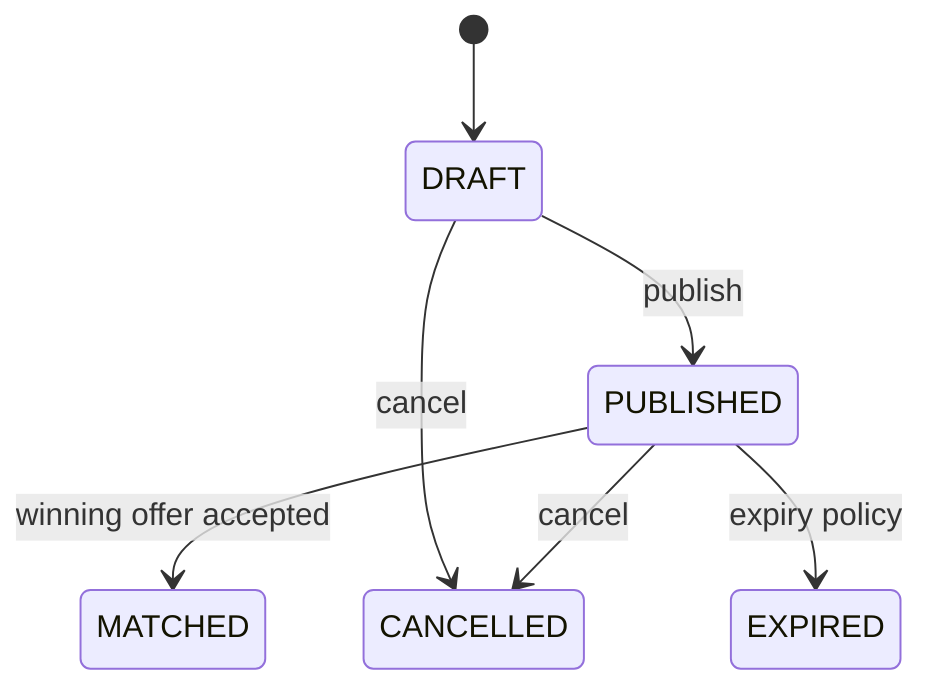
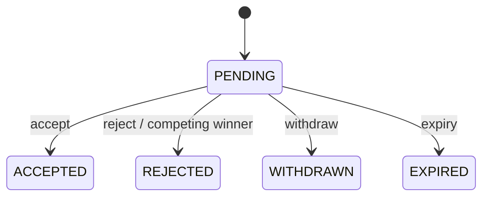
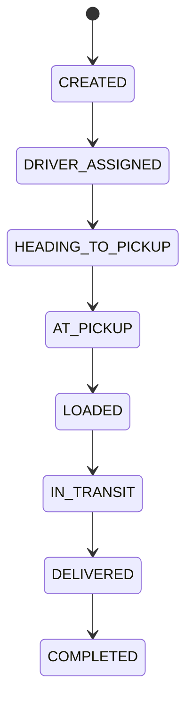

# Holat mashinalari — Architecture v1.0 Lock

Transitionlar backend domain logicida bajariladi. Client faqat command so‘raydi; permission transitionning o‘ziga qo‘shimcha ravishda resource relationshipni ham tekshiradi. Ro‘yxatda yo‘q transition invalid.

## Load

| From | To | Actor va shart | Event |
| --- | --- | --- | --- |
| — | `DRAFT` | `LOAD_CREATE`; individual owner yoki authorized company member | internal `LoadCreated` only; cross-module event shart emas |
| `DRAFT` | `PUBLISHED` | owner/scoped member; `LOAD_EDIT`; publish invariantlari valid | `LoadPublished` |
| `DRAFT` | `CANCELLED` | owner/scoped member; `LOAD_CANCEL` | `LoadCancelled` |
| `PUBLISHED` | `MATCHED` | marketplace `MatchLoad`; original actor `OFFER_ACCEPT`; accepted offer ID birinchi marta o‘rnatiladi | `LoadMatched` va marketplace `OfferAccepted` |
| `PUBLISHED` | `CANCELLED` | owner/scoped member; `LOAD_CANCEL`; winner hali yo‘q | `LoadCancelled` |
| `PUBLISHED` | `EXPIRED` | system expiry policy | `LoadExpired` |

**Terminal:** `MATCHED`, `CANCELLED`, `EXPIRED`. Shipment completion loadni yana bir “closed” lifecycle orqali takrorlamaydi.

**Invalid misollar:** `DRAFT -> MATCHED`, `MATCHED -> CANCELLED`, terminaldan har qanday transition, accepted offer IDni almashtirish.

**Concurrency.** `PUBLISHED` row/version acceptance va cancellation o‘rtasidagi serialization point. `MatchLoad(expectedVersion)` lock yoki compare-and-set bilan aynan bitta winner o‘rnatadi. Yutqazgan concurrent accept/cancel deterministik conflict qaytaradi.

## Offer

| From | To | Actor va shart | Event |
| --- | --- | --- | --- |
| — | `PENDING` | eligible driver/carrier; `OFFER_CREATE`; load `PUBLISHED` | `OfferCreated` |
| `PENDING` | `ACCEPTED` | load owner/scoped member; `OFFER_ACCEPT`; `MatchLoad` muvaffaqiyatli | `OfferAccepted` |
| `PENDING` | `REJECTED` | load owner/scoped member yoki accepted competing offer/load cancellation/expiryga javoban system | `OfferRejected` |
| `PENDING` | `WITHDRAWN` | offer creator; `OFFER_WITHDRAW` | `OfferWithdrawn` |
| `PENDING` | `EXPIRED` | system expiry policy | `OfferExpired` |

**Terminal:** `ACCEPTED`, `REJECTED`, `WITHDRAWN`, `EXPIRED`.

**Invalid misollar:** terminal offerni qayta ochish, `REJECTED -> ACCEPTED`, creatorning o‘z offerini accept qilishi, boshqa creator offerini withdraw qilish.

**Concurrency.** `AcceptOffer` bitta transactionda loadni `MATCHED`, winner offerni `ACCEPTED`, qolgan pending offerlarni `REJECTED` qiladi va reliable event publication yozadi. `marketplace.offers(load_id) WHERE status='ACCEPTED'` partial unique constraint oxirgi himoya. Offer/load version conflict qayta o‘qish talab qiladigan domain conflict, silent retry bilan boshqa winner tanlanmaydi.

## Shipment

| From | To | Actor va shart | Event |
| --- | --- | --- | --- |
| — | `CREATED` | reliable/idempotent `OfferAccepted` handler | `ShipmentCreated` |
| `CREATED` | `DRIVER_ASSIGNED` | system; assignment accepted offerdagi driver/carrier/vehicle IDlaridan | `ShipmentStatusChanged` |
| `DRIVER_ASSIGNED` | `HEADING_TO_PICKUP` | assigned driver; `SHIPMENT_STATUS_UPDATE` | `ShipmentStatusChanged` |
| `HEADING_TO_PICKUP` | `AT_PICKUP` | assigned driver; `SHIPMENT_STATUS_UPDATE` | `ShipmentStatusChanged` |
| `AT_PICKUP` | `LOADED` | assigned driver; `SHIPMENT_STATUS_UPDATE` | `ShipmentStatusChanged` |
| `LOADED` | `IN_TRANSIT` | assigned driver; `SHIPMENT_STATUS_UPDATE` | `ShipmentStatusChanged` |
| `IN_TRANSIT` | `DELIVERED` | assigned driver; `SHIPMENT_STATUS_UPDATE` | `ShipmentStatusChanged`, `ShipmentDelivered` |
| `DELIVERED` | `COMPLETED` | load owner/scoped company member confirms; `SHIPMENT_STATUS_UPDATE` | `ShipmentStatusChanged`, `ShipmentCompleted` |

`CREATED -> DRIVER_ASSIGNED` external user command emas. Handler ikki transitionni bitta creation transactionida bajarishi va ikki history record yozishi mumkin; persisted current status `DRIVER_ASSIGNED` bo‘ladi.

**Terminal:** `COMPLETED`.

**Invalid misollar:** skip/backward transition, `CREATED -> DELIVERED`, assigned bo‘lmagan driver update’i, driverning `DELIVERED -> COMPLETED`ni o‘zi tasdiqlashi.

**Concurrency.** Har command `expectedVersion` yoki idempotency key bilan; aggregate transition va `shipment_status_history` insert bitta transactionda. Bir xil successful command retry’i yangi history/event yaratmaydi; competing stale command conflict oladi.

## Deferred yo‘llar

Shipment/load cancellation after match, driver reassignment, failed pickup/delivery, dispute, forced admin correction va auto-completion v1 state machine’ga kiritilmadi. Ularning actor, audit va counterpart consent qoidalari yetarli aniqlanmaguncha implementation qilinmaydi; [open questions](open-questions.md)da kuzatiladi. Payment/dispute state shipment statusiga qo‘shilmaydi.
