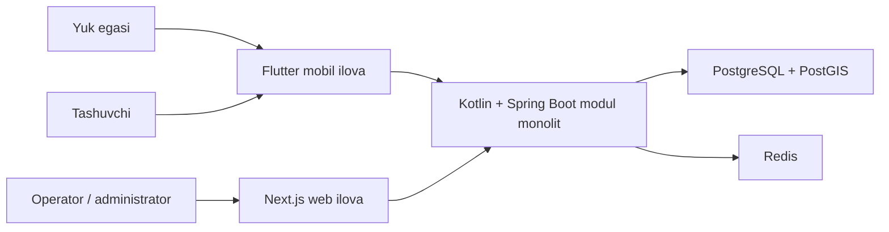

# Tizim konteksti

## Maqsad

Platforma O‘zbekistondagi yuk egalarini va tashuvchilarni yuk tashish buyurtmalari atrofida bog‘laydi. Aniq biznes rollari, jarayonlar va monetizatsiya qoidalari keyingi ADR va domen hujjatlarida tasdiqlanadi.

## Boshlang‘ich kontekst

## Chegaralar

- mobil va web mijozlar backend bilan faqat hujjatlashtirilgan API orqali ishlaydi;
- PostgreSQL doimiy ma’lumotlarning asosiy manbai;
- PostGIS geografik ma’lumot va so‘rovlar uchun PostgreSQL ichida ishlaydi;
- Redis faqat vaqtinchalik yoki qayta tiklanadigan ma’lumot uchun ishlatiladi;
- mijoz ilovalari boshqa modulning ma’lumotlar bazasi tuzilishiga bog‘lanmaydi.

## Ochiq savollar

Quyidagilar mavjud arxitektura suhbatidan ko‘chirilgach alohida qaror sifatida qayd etiladi:

- foydalanuvchi rollari va ishonch modeli;
- buyurtma, taklif, bronlash va bajarish jarayonlari;
- identifikatsiya va autentifikatsiya;
- real vaqt yangilanishlari va bildirishnomalar;
- to‘lov va komissiya modeli;
- geolokatsiyani yig‘ish, saqlash muddati va ko‘rish huquqlari;
- audit va nizolarni hal qilish talablari.
