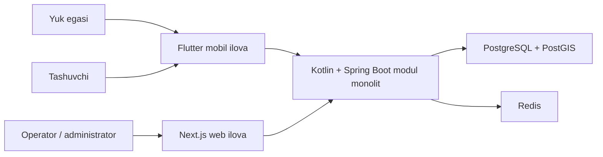

# Tizim konteksti

## Maqsad

Platforma O‘zbekistondagi yuk egalarini va tashuvchilarni yuk tashish buyurtmalari atrofida bog‘laydi. Aniq biznes rollari, jarayonlar va monetizatsiya qoidalari keyingi ADR va domen hujjatlarida tasdiqlanadi.

## Boshlang‘ich kontekst

## Chegaralar

- mobil va web mijozlar backend bilan faqat hujjatlashtirilgan API orqali ishlaydi;
- PostgreSQL doimiy ma’lumotlarning asosiy manbai;
- PostGIS geografik ma’lumot va so‘rovlar uchun PostgreSQL ichida ishlaydi;
- Redis faqat vaqtinchalik yoki qayta tiklanadigan ma’lumot uchun ishlatiladi;
- mijoz ilovalari boshqa modulning ma’lumotlar bazasi tuzilishiga bog‘lanmaydi.

## Ochiq savollar

Role/permission, Load/Offer/Shipment lifecycle, geospatial representation va audit baseline Architecture v1.0’da lock qilingan. Haqiqatan ochiq feature/product/legal qarorlar yagona [open questions register](open-questions.md)da saqlanadi.
