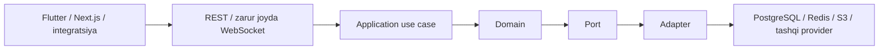

# Tizim arxitekturasi — v1.0

## Maqsad

O‘zbekistonda yuk egalari, kompaniyalar, haydovchilar va transport vositalarini bog‘laydigan marketplace’ni MVP uchun yetarlicha sodda, keyinchalik esa qayta yozmasdan o‘stirish mumkin bo‘lgan shaklda qurish.

## Mijozlar

- mobil: Flutter (Android/iOS);
- web: Next.js, React va TypeScript;
- kelajakda: hamkor API’lari, Telegram va enterprise integratsiyalar.

## Backend uslubi

- Kotlin, Java 25 LTS va Spring Boot;
- Spring Security;
- Spring Modulith bilan modul monolit;
- DDD-lite va hexagonal arxitektura;
- o‘qish samaradorligi zarur joylarda CQRS-lite;
- REST asosiy transport, WebSocket faqat aniq realtime talab mavjud bo‘lganda.

Domain Spring MVC, JPA annotation/entity, Redis client, Firebase, xarita/SMS provider yoki S3 SDK’ga bog‘lanmaydi. Tashqi texnologiyalar port va adapter ortida qoladi.

## Ma’lumot va infratuzilma

- PostgreSQL/PostGIS — yagona source of truth;
- JPA/Hibernate — transactional write flow;
- jOOQ — feed, qidiruv, reporting va murakkab read query;
- Redis — cache, OTP, rate limit va qayta tiklanadigan vaqtinchalik realtime holat;
- S3-compatible object storage, lokalda MinIO — fayllar, maxfiy obyektlar private holatda;
- Flyway — sxema migratsiyasi;
- OpenAPI — versiyalangan API shartnomasi;
- Docker/Docker Compose — reproduktiv lokal runtime va container asosidagi deployment.

Test baseline: JUnit va Testcontainers. PostgreSQL/PostGIS integration testlari H2 bilan almashtirilmaydi.
